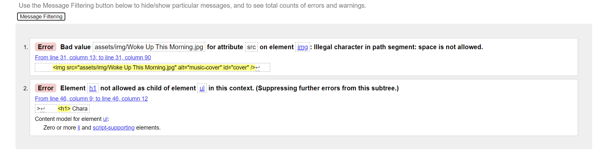
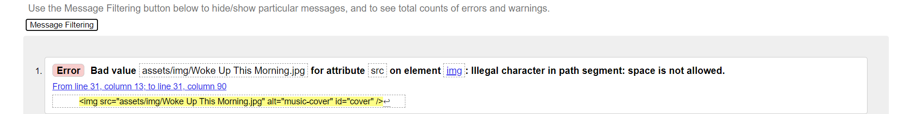
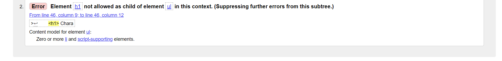
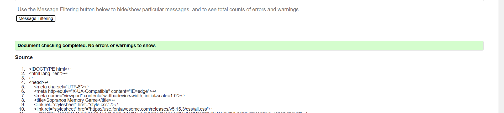
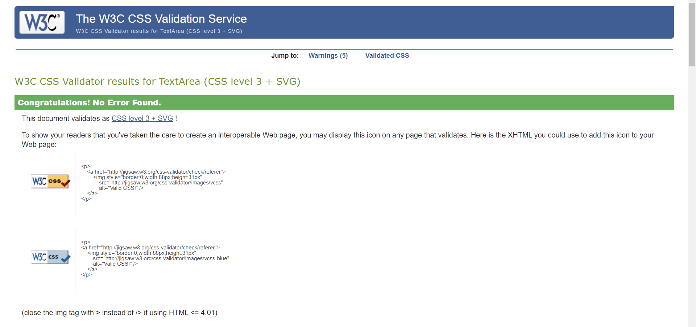
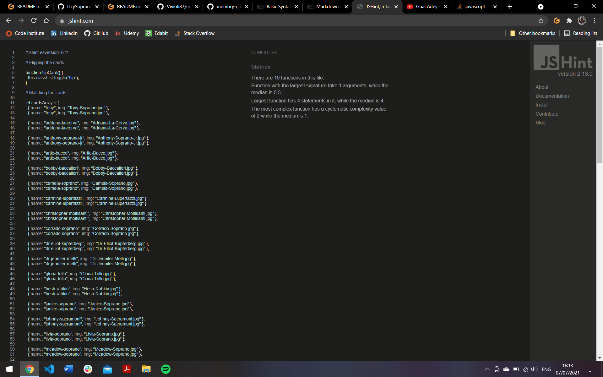
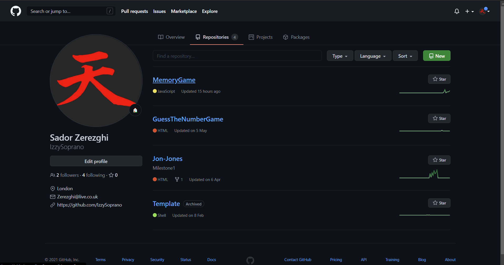
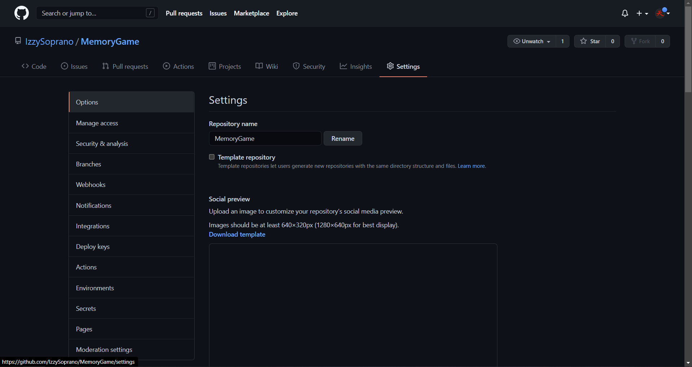
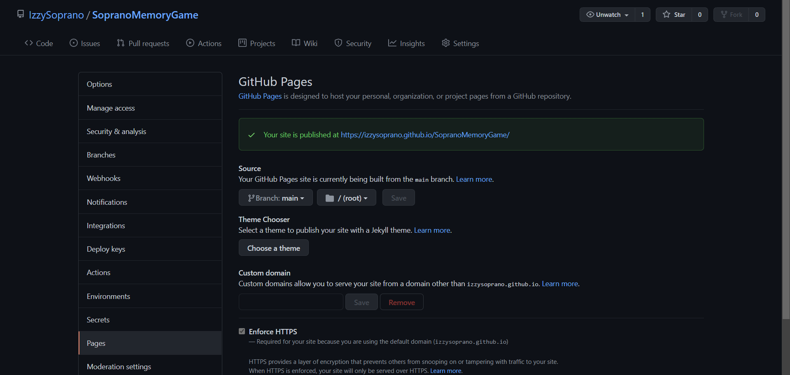

# Table of Contents

View the live project here - https://izzysoprano.github.io/MemoryGame/

1. [Overview](#Overview)
2. [User Experience](#UX-(UserExperience))

   - [User Stories](##UserStories)

   - First Time Visitor Goals
   - Returning Visitor Goals
   - Developer Goals

   - [Structure](##Structure)
   - [Skeleton](##Skeleton)
   - [Wireframes](##Wireframes)

3. [Design](#Design)

   - Colour Scheme
   - Fonts
   - Imagery
   - Audio

4. [Features](#Features)

5. [Languages Used](#LanguagesUsed)

6. [Frameworks, Libaries, Tools](#FrameworksLibariesTools)

7. [Testing](#Testing)

8. [Deployment](#Deployment)

9. [Credits](#Credits)

# Overview

For this milestone project, I wanted to create an interactive card matching game inspired by my favourite TV show, The Sopranos.
The game will be simple, to match the 20 character cards.
The game will also feature an interactive music player that will have the opening theme song of the show.

Developed and designed as part of Milestone Project 2: Interactive Frontend Development for Code Institute.

# UX User Experience

## User Stories

### First time Visitor Goals

- As a first time visitor, I would like to play a simple card-matching game inspired by the theme of The Sopranos.
- As a first time visitor, I would like to play/pause the theme song of the show.
- As a first time visitor, I would like the game to be responsible on all devices.
- As a first time visitor, I want to be familiar with the character names.

### Returning Vistor Goals

As a returning visitor, I would like to play a game that challenges my memory

### Developer Goals

- As a developer, I would like to create a simple, logical memory game inspired by the The Sopranos that anyone can play.
- As a developer, I would like to create an interactive game using HTML, CSS and Javascript.
- As a developer, I would like to create famliarity with the Sopranos cast for users.
- As a developer, I would like to create an interactive music player

## Structure 

## Skeleton

## Wireframes

# Design

## Colour Scheme

- It's important for the site to follow the the color scheme from the show in order to create a feel that the game is inspired by the TV Show.
- The three main colours of the TV show are black, white and red. The title **The Sopranos** is shown in a white or red colour depending on the source. I have decided to go for the white colour as its the most common.

For the background, the colour will be black.

Each card will be blended into the black background, as the back of the card which will display the main title, will represent each card. Like this:

## Fonts

For the character checklist, I decided to use Big Shoulder Stencil from [Google Fonts](https://fonts.google.com/) as I felt it was a close match to the main title.

## Imagery

The cards for the game will hold characters from the TV show. I have selected 20 characters from the show as the front of the card.

*[Adriana La Cerva](https://www.hbo.com/the-sopranos/cast-and-crew/adriana-la-cerva)
*[Anthony Soprano Jr](https://www.hbo.com/the-sopranos/cast-and-crew/anthony-soprano-jr)
*[Artie Bucco](https://www.hbo.com/the-sopranos/cast-and-crew/artie-bucco)
*[Bobby Baccalieri](https://www.hbo.com/the-sopranos/cast-and-crew/bobby-bacala-baccalieri)
*[Carmela Soprano](https://www.hbo.com/the-sopranos/cast-and-crew/carmela-soprano)
*[Carmine Lupertazzi](https://www.hbo.com/the-sopranos/cast-and-crew/carmine-lupertazzi)
*[Christopher Moltisanti](https://www.hbo.com/the-sopranos/cast-and-crew/christopher-moltisanti)
*[Corrado Soprano](https://www.hbo.com/the-sopranos/cast-and-crew/corrado-junior-soprano)
*[Dr. Elliot Kupferberg](https://www.hbo.com/the-sopranos/cast-and-crew/dr-elliot-kupferberg)
*[Dr. Jennifer Melfi](https://www.hbo.com/the-sopranos/cast-and-crew/dr-jennifer-melfi)
*[Gloria Trillo](https://www.hbo.com/the-sopranos/cast-and-crew/gloria-trillo)
*[Hesh Rabkin](https://www.hbo.com/the-sopranos/cast-and-crew/hesh-rabkin)
*[Janice Soprano](https://www.hbo.com/the-sopranos/cast-and-crew/janice-soprano)
*[Johnny Sacramoni](https://www.hbo.com/the-sopranos/cast-and-crew/johnny-sack-sacramoni)
*[Livia Soprano](https://www.hbo.com/the-sopranos/cast-and-crew/livia-soprano)
*[Meadow Soprano](https://www.hbo.com/the-sopranos/cast-and-crew/meadow-soprano)
*[Paulie Walnut](https://www.hbo.com/the-sopranos/cast-and-crew/paulie-walnuts)
*[Sal Bonpensiero](https://www.hbo.com/the-sopranos/cast-and-crew/sal-big-pussy-bonpensiero)
*[Silvio Dante](https://www.hbo.com/the-sopranos/cast-and-crew/silvio-dante)
*[Tony Soprano](https://www.hbo.com/the-sopranos/cast-and-crew/tony-soprano)

The Music Player will feature a spinning feature which will resemble a record player.

__Album Artwork__: [Artwork](https://www.amazon.com/Woke-Up-This-Morning-Alabama/dp/B000000OP7)

## Audio

The site will include the intro song added to the game.
It will include the song, **_Woke Up This Morning by Alabama 3_**

**Download Link:** [Woke Up This Morning](https://mp3paw.lol/mp3-download/1418146/Woke-Up-This-Morning)

# Features

- Interactive Card Matching Game
- Interactive Music Player

# Languages Used

- HTML
- CSS
- JavaScript

# Resources, Libraries and Tools

- [Font Awesome](https://fontawesome.com/)
- [Google Fonts](https://fonts.google.com/)
- [Stack Overflow](https://stackoverflow.com/) 
- [Google Chrome Developer Tools](https://developers.google.com/web/tools/chrome-devtools)
- [GitHub](https://github.com/)
- [Gitpod](https://gitpod.io/)
- [Git](https://git-scm.com/) 
- [Markdown guide](https://www.markdownguide.org/basic-syntax/)
- [HBO Cast & Crew](https://www.hbo.com/the-sopranos/cast-and-crew)

## Validation 
- [W3C Markup Validation Service](https://validator.w3.org/#validate_by_input)

   **Two Erros**
   

   **Error 1**
   It seems that I have incorrectly added spacing to the file name which is causing the error. I've added dash 
   

   **Error 2**
   I added a `<h1>` tag to `<ul>` which made the `<h1>` tag the child element. W3 doesn't recognise this as valid, therefore I have moved the `<h1>` tag outside the `<ul>` tag 
   

   **W3 HTML Validator Complete**
   

- [W3C CSS Validation Service](https://jigsaw.w3.org/css-validator/#validate_by_input)

   **CSS Validator Complete**
   

- [jshint.com](https://jshint.com/)

**JSHint Validator Complete**

# Testing

- **Performace Testing**

- **Device Testing**

## Known Bugs

# Deployment

**GitHub pages**
The project deployment to GitHub Pages is explained in the below steps:

1.  Sign in to GitHub, locate and select [Memory game](https://github.com/IzzySoprano/MemoryGame) from the list of repositories.

2.  At the top of the Repository page, under the sub-headings, click "Settings" button

3.  Scroll down the page until you reach "GitHub Pages" section.
4.  Under the "Source" sub-section, select "master" branch.
5.  Click "Save" button.
6.  The page will refresh. To locate the link to the published site, scroll down again to the "GitHub Pages" section. Your link will be highlighted in the green box.

# Credits

### Code

-[Flip Cards with Javascript](https://dev.to/mugas/flip-cards-with-javascript-2ad0)

-[Create a Memory Game with JavaScript](https://dev.to/fakorededamilola/create-a-memory-game-with-js-1l9j#content-3)

### Media

-[Build a Music Player | Vanilla Javascript by Traversy Media](https://www.youtube.com/watch?v=QTHRWGn_sJw&ab_channel=TraversyMedia)

### Books

- **JavaScript and Jquery** by __Jon Duckett__

### Acknowledgements

- My Mentor - Narender Singh
- Tutor Support
- Student Care
- Slack community 
- Stack Overflow
