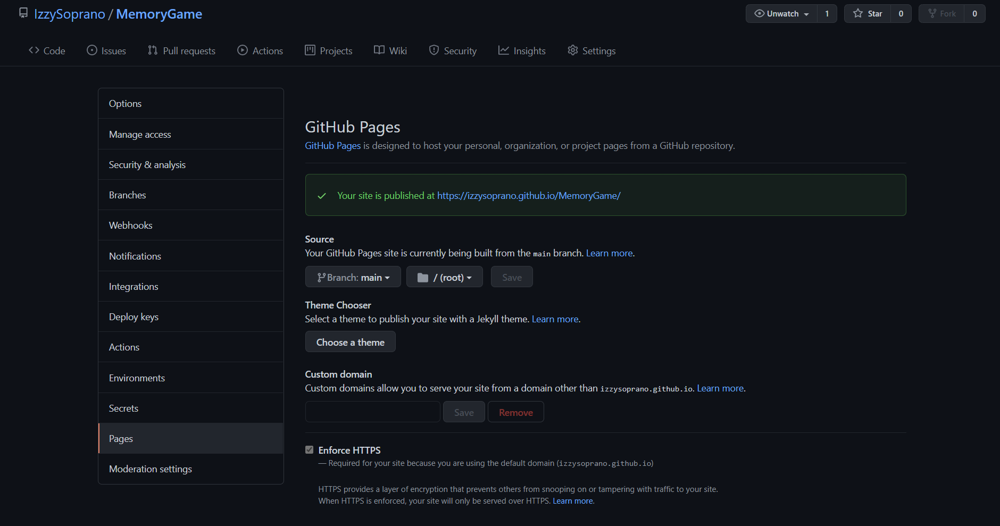

# Table of Contents

View the live project here - https://izzysoprano.github.io/MemoryGame/

1. [Overview](#Overview)
2. [User Experience](#UX-UserExperience))

   - [User Stories](#UserStories)

   - First Time Visitor Goals
   - Returning Visitor Goals
   - Developer Goals

3. [Design](#Design)

   - Colour Scheme
   - Fonts

- Imagery
- Audio

4. [Wireframes](#Wireframes)

5. [Features](#Features)

6. [Languages Used](#LanguagesUSed)

7. [Frameworks, Libaries, Tools](#FrameworksLibariesTools)

8. [Testing](#Testing)

9. [Deployment](#Deployment)

   10.[Credits](#Credits)

## Overview

For this milestone project, I wanted to create an interactive card matching game inspired by my favourite TV show, The Sopranos.
The game will be simple, to match the 20 character cards.
The game will also feature an interactive music player that will have the opening theme song of the show as an option to play/pause.

Developed and designed as part of Milestone Project 2: Interactive Frontend Development for Code Institute.

# User Experience

## User Stories

### First time Visitor Goals

- As a first time visitor, I would like to play a simple card-matching game inspired by the theme of The Sopranos.
- As a first time visitor, I would like to play/pause the theme song of the show.
- As a first time visitor, I would like the game to be responsible on all devices.
- As a first time visitor, I want to be familiar with the character names.

### Returning Vistor Goals

As a returning visitor, I would like to play a game that challenges my memory

### Developer Goals

- As a developer, I would like to create a simple, logical memory game inspired by the The Sopranos that anyone can play.
- As a developer, I would like to create an interactive game using HTML, CSS and Javascript.
- As a developer, I would like to create famliarity with the Sopranos cast for users.
- As a developer, I would like to create an interactive music player

# Design

## Colour Scheme

- It's important for the site to follow the the color scheme from the show in order to create a feel that the game is inspired by the TV Show.
- The three main colours of the TV show are black, white and red. The title **The Sopranos** is shown in a white or red colour depending on the source. I have decided to go for the white colour as its the most common.

For the background, the colour will be black.

Each card will be blended into the black background, as the back of the card which will display the main title, will represent each card. Like this:

## Fonts

For the character checklist, I decided to use Big Shoulder Stencil from [Google Fonts](https://fonts.google.com/) as I felt it was a close match to the main title.

## Audio

The site will have the intro song added to the game.
It will include the song, **_Woke Up This Morning by Alabama 3_**

Source: (https://mp3paw.lol/mp3-download/1418146/Woke-Up-This-Morning)

## Imagery

The cards for the game will hold characters from the TV show. I have selected 20 characters from the show as the front of the card.

        - ![Adriana La Cerva] (https://www.hbo.com/the-sopranos/cast-and-crew/adriana-la-cerva)
        - [Anthony Soprano Jr] (https://www.hbo.com/the-sopranos/cast-and-crew/adriana-la-cerva)
        
        

        - Bobby Baccalieri
        - Carmela Soprano
        - Carmine Lupertazzi
        - Christopher Moltisanti
        - Corrado Soprano
        - Dr. Elliot Kupferberg
        - Dr. Jennifer Melfi
        - Gloria Trillo
        - Hesh Rabkin
        - Janice Soprano
        - Johnny Sacramoni
        - Livia Soprano
        - Meadow Soprano
        - Paulie Walnut
        - Sal Bonpensiero
        - Silvio Dante
        - Tony Soprano

The Music Player will feature a spinning feature which will resemble a record player.

Source: 

Source: 

# Wireframes

# Features

- Interactive Card Matching Game
- Interactive Music Player

# Languages Used

- HTML
- CSS
- Javascript

# Frameworks, Libraries and Tools

- Font Awesome
- Google Fonts

# Testing

- Further Testing

- Known Bugs

# Deployment

- GitHub pages

# Credits

- Code

-https://dev.to/mugas/flip-cards-with-javascript-2ad0

-https://dev.to/fakorededamilola/create-a-memory-game-with-js-1l9j#content-3

- Media

- Build a Music Player | Vanilla Javascript https://www.youtube.com/watch?v=QTHRWGn_sJw&ab_channel=TraversyMedia

- Resources

### Books

-Javascript and JQuery by Jon Duckett

- Acknowledgements

My mentor [Narender Singh]
Tutor [John]
Slack Community
Stack overflow
